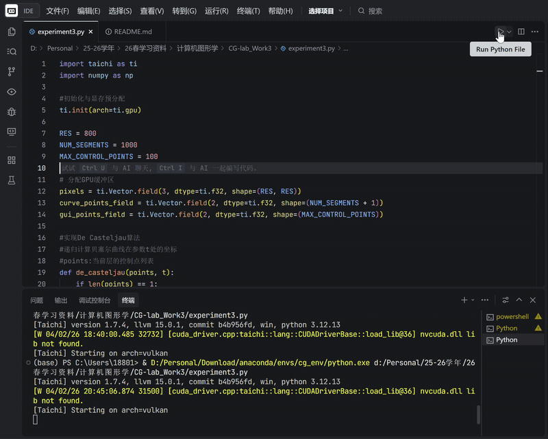
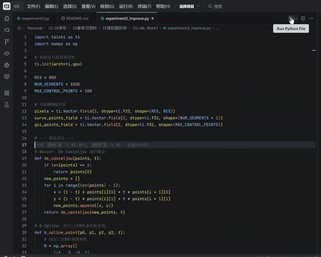

# 实验报告1：基于 Taichi 的贝塞尔曲线光栅化实现

## 一、项目介绍
本项目旨在通过Python编程语言与高性能图形计算库Taichi，手动实现一个交互式的贝塞尔曲线光栅化渲染器。

在现代图形渲染管线中，屏幕本质上是一个二维像素网格。本项目不直接调用高层绘图 API 绘制曲线，而是通过De Casteljau 算法计算曲线点坐标，并利用GPU并行内核(Kernel)手动点亮对应的像素（修改显存 Field），从而模拟真实的光栅化成像过程。

## 二、项目架构

### 2.1 技术栈
* 计算后端: Taichi，利用 GPU 并行处理加速渲染
* 数据中转: NumPy，用于 CPU 计算结果与 GPU 显存间的批量数据交换
* 交互窗口: Taichi GGUI，提供 60 FPS 的实时交互与事件监听

### 2.2 目录结构
本项目采用单文件结构，便于调试与部署：
 `experiment3.py`: 核心源代码（包含De Casteljau算法、GPU渲染内核及主循环）

## 三、代码逻辑

程序运行遵循“计算-传输-渲染”的典型图形学处理流程，具体逻辑如下：

### 3.1 坐标计算 (CPU 端)
* 算法选择: 采用 De Casteljau 算法。通过对控制点进行 $n$ 阶线性插值（LERP），精确获取曲线在参数 $t \in [0, 1]$ 时的归一化浮点坐标。
* 计算模式: 在Python环境下循环1000次进行曲线采样，以保证曲线的平滑度。

### 3.2 批处理传输 (Batching)
* 为了优化性能，避免CPU与GPU之间频繁的小数据跨界通信，程序将1001个采样点坐标先存入NumPy数组。
* 利用 `from_numpy()` 方法，将数据通过PCIe总线一次性推送到GPU显存缓冲区 `curve_points_field` 中。

### 3.3 GPU 并行光栅化 (Kernel)
* 并行映射: `@ti.kernel` 装饰的渲染函数会在 GPU 上为每个采样点分配独立线程。
* 坐标转换: 将 $[0, 1]$ 范围的归一化坐标乘以屏幕尺寸（800x800），并强制转换为整数索引。
* 像素点亮: 在显存Field `pixels` 的对应索引位置赋绿色值，实现手动光栅化。

### 3.4 对象池技巧 (Object Pooling)
* 预分配固定长度（100）的 `gui_points` 缓冲区。
* 对于未激活的控制点，将其坐标初始化为屏幕外（-10.0），避免了在主循环中动态申请显存导致的系统卡顿。

## 四、实现功能

1.  交互式点选: 支持用户通过鼠标左键在画布上任意点击添加控制点。
2.  动态响应: 每当控制点状态改变，程序立即重新计算并更新曲线，保持 60 FPS 的实时反馈。
3.  底层光栅化模拟: 通过修改二维数组（Field）模拟显存操作，而非简单的矢量绘制。
4.  辅助显示: 实时渲染控制多边形（灰色折线）与控制点（红色圆点），便于观察曲线生成原理。
5.  一键重置: 支持按下键盘 'C' 键清空所有控制点与像素缓冲区。

---

## 五、实验结果展示

| 交互行为 | 渲染效果说明 |
| :--- | :--- |
| 鼠标左键点击 | 屏幕即时出现红色圆点，后台记录其归一化坐标。 |
| 添加两个及以上点 | GPU 瞬间生成连接各点的绿色贝塞尔曲线，并伴有灰色控制多边形辅助线。 |
| 连续绘制 | 随着点数增加，曲线呈现平滑的高阶几何形态，渲染无延迟。 |
| 按下 'C' 键 | 画面瞬间恢复全黑，显存缓冲区完成清理。 |

## 结论:
本实验成功通过 Taichi 框架验证了 De Casteljau 算法的有效性，并深入理解了 GPU 并行计算在图形光栅化过程中的性能优势。

### 实验结果展示

# 实验报告2：贝塞尔曲线与 B 样条曲线的抗锯齿光栅化实现(选做)

## 一、 项目架构

* 计算层 (CPU)：
    * Bezier 模块：利用 De Casteljau 递归算法实现任意阶贝塞尔曲线插值。
    * B-Spline 模块：利用均匀三次 B 样条基矩阵 (Basis Matrix) 实现分段多项式插值。
    * 交互逻辑：监听用户鼠标与键盘输入，动态维护控制点列表。
* 渲染层 (GPU)：
    * 像素缓冲区 (pixels)：存储 800 x 800 的 RGB 颜色数据。
    * AA 光栅化内核 (draw_curve_kernel)：核心抗锯齿渲染器，负责将连续的浮点坐标映射为离散的亚像素光强。
    * 状态清理内核 (clear_pixels)：每一帧重置显存。

## 二、 代码逻辑

### 1. 反走样 (Anti-Aliasing) 逻辑
传统的硬核光栅化直接对浮点坐标取整 (int(x))，导致边缘突变产生“阶梯效应”。
* 亚像素采样：保留计算出的 $P(t)$ 浮点精度。
* 距离衰减模型：对于曲线上的每一个理论点，在 GPU 内部考察其周围 3 x 3 的像素邻域。
* 权重分配：计算像素中心点与理论点之间的欧氏距离 $dist$，采用线性径久衰减函数：
    $$Intensity = \max(0.0, 1.0 - \frac{dist}{Radius})$$
* 混合叠加：使用 ti.atomic_add 将颜色权重累加到像素点。距离越近，贡献的色彩亮度越高，从而在视觉上形成平滑的过渡边缘。

### 2. 均匀三次 B 样条逻辑
解决了贝塞尔曲线“牵一发而动全身”的问题。
* 基矩阵计算：采用固定的 4 x 4 基矩阵 $M$：
    $$M = \frac{1}{6} \begin{bmatrix} -1 & 3 & -3 & 1 \\ 3 & -6 & 3 & 0 \\ -3 & 0 & 3 & 0 \\ 1 & 4 & 1 & 0 \end{bmatrix}$$
* 分段绘制：若有 n 个控制点，则循环生成 n-3 段曲线。每段曲线由 $P_i, P_{i+1}, P_{i+2}, P_{i+3}$ 四个点决定。
* 局部性实现：通过这种分段机制，移动某个控制点仅会影响其参与计算的相邻四段曲线，其余部分保持恒定。

### 3. 交互与模式切换
* 状态机控制：定义 mode 变量，通过键盘 Z (Bezier) 与 B (B-Spline) 进行实时切换。
* 动态缓冲区映射：根据不同算法生成的采样点数量，动态更新 curve_points_field 并同步至显存。

## 三、 实现结果

### 1. 渲染质量对比
* 未改进前：曲线呈现明显的锯齿，在斜率较小时出现断裂感。
* 改进后 (AA)：曲线边缘柔和，视觉连续性极强。即便在高倍率观察下，曲线的粗细感均匀，达到了专业级矢量绘图软件的渲染效果。

### 2. 几何特性验证
* 贝塞尔曲线 (Z 模式)：曲线整体平滑地穿过控制点围成的凸包。移动起始点，全段曲线都会发生微小形变，验证了其全局控制特性。
* B 样条曲线 (B 模式)：曲线更加“紧致”，且不会直接通过控制点。在点数较多时，修改中间的控制点，曲线两端完全静止，验证了局部控制特性。

### 3. 性能表现
由于核心渲染逻辑运行在 GPU 显存中，即便开启了 3 x 3 邻域的 AA 计算，由于 Taichi 的并行加速，程序依然能保持 60+ FPS 的实时交互响应速度。

> 结论：本实验成功实现了具有亚像素精度的抗锯齿渲染管线，并通过矩阵法高效集成了 B 样条曲线，解决了复杂曲线设计中的局部调整难题。

### 4.结果样例展示
